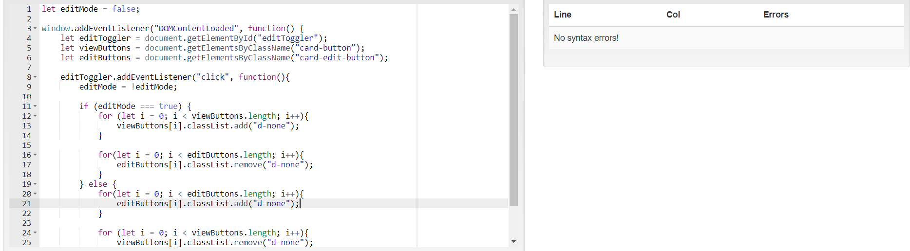
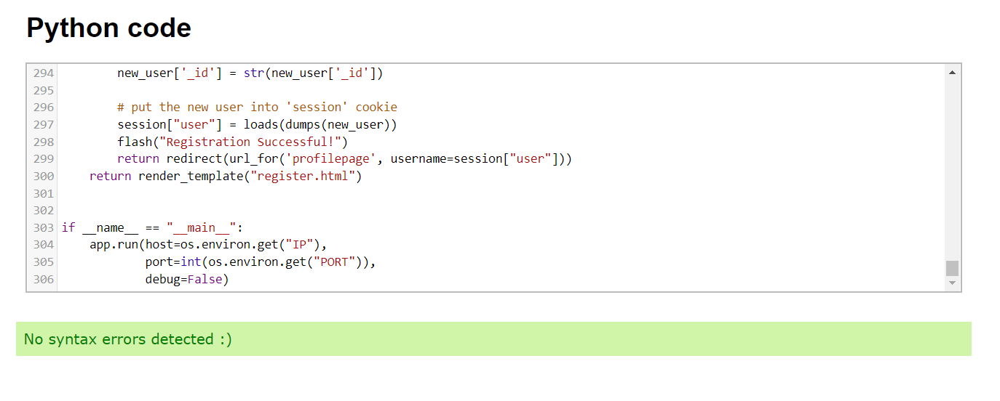

# Book Review Webiste

This is a book review website. Users can use the website to search for information on books as well as leave book reviews.

## User Experience

### Strategy Plane
What is the idea or product?

- The idea behind this book review website is to provide both users and owners with a platform. This platform should allow them to search and review books.

Who is the user?
- Users of this website are book enthusiasts, bloggers, readers, and reviewers. Also, any other people, that are interested in books and their reviews.

The site’s owner goals:
- The owner wants to build an online library of books. 
- The library should have an option for users to register.
- Both registered and non-registered users should be able to navigate websites and view books and their reviews.
- Registered users should have the option to leave and edit their reviews on books.
- The owner wants to be able to save a specific book to his profile for later reference or update on reviews.
- The owner wants to have a section that shows what books are the most reviewed on the website.

### Scope Plane
The features that the website should include:
- [x] Database cluster for books.
- [x] Database with user accounts.
- [x] Registration form.
- [x] Login form.
- [x] Landing page.
- [x] Library page.
- [x] User page.
- [x] Contact page.
- [x] User book review input form.
- [x] Ability to logout from profile page.
- [x] Ability to create new review.
- [x] Ability to edit and update review.
- [x] Ability to read reviews.
- [x] Ability to delete review.
- [x] Ability to add book in library.

### Structure Plane
The information architutre:
- Flow of information should be clear and consistent through out the design.

The interaction design:
- When user opens the landing page for the first time he will be informed about what Book Review website is, and what value can website provide to him or her.
- The landing page should also conatin visuals in form of images that clearly convay the meaning that this is a website that has something to do with books.
- The landing page should contain call-to-action to invoke a lead.
- Library page will conatin a preview of all the books that can be found in the database.
- Books should be displayed in the librery using bootstrap cards where each card will contain an image and preview text.
- User can open each book in librery by clicking on the card.
- User page should contain information that the user has provided when he signed up.
- User should be able to view his saved books on his user page.
- Only register users will be able to leave a review.
- Review will contain one input field and submit button.
- Contact page will contain conatact information and email form.
- Contact information should conatin owners phone and email address.

### Sceleton plane
The site will conatin 7 pages:
- Homepage
- Registration page
- Login page
- Library page
- User page
- Book page
- Contact page

#### Navigation
- User will be able to navigate the website using websites' navigation. 
- User page will only be made avalible to the user if he is loged in.
- Nav bar will be contain buttons for login or logout, and registration.
- Nav bar will contain website logo.
- Nav menu on the phone will be activated by clicking on a burger icon.

### Surface

Website color pallete:

### Mockups
- Mockups were created using Adobe Xd

### Testing

- All navigation links have been test mobile, tablet, destop.
- Search bar on home page is test, search for a book in librery.
- All CRUD operation tested.
- Register page tested.
- Login/Logout tested.
- Contact page tested.

### Testing User Stories
#### All users are available to :
- Use "search" on home page.
- Browse library page, and use button "Read more", and read reviews
- Use contact page
- And register
#### Only registered users are available to :
- Login in their account
- Add books in library
- Edit books from library
- Delete books form library
- Write review
- Edit review
- Delete review
- View a profile page

### Validation
- [x] Html validation on each page using (https://validator.w3.org/) button errors found on Contact page and Home page. 
- [x] Css validation using (https://jigsaw.w3.org/css-validator/) no Errors:

- [x] JS validation using (https://beautifytools.com/javascript-validator.php) no errors found.

- [x] Autoprefix css
- [x] Python validation using (https://extendsclass.com/python-tester.html) no syntax errors found.

### Deployment

- In terminal window type, pip3 freeze -- local > requirements.txt. (The file is needed for Heroku to know which filed to install.)
- Go on Heroku website and 'Create new app'
- Then set up deployment method 'Github.
- Search for repository to connect with it, and connect with it.
- Go to settings and then Config Vars  then set up key, values from env.py(IP, PORT, SECRET_KEY, MONGO_URI, MONGO_DBNAME).
- Then update requirements.txt and create Procfile.
- Finally enable automatic deployment

### Credits

- Bootstrap
- Login/Register page from "Mini-project" lessions.